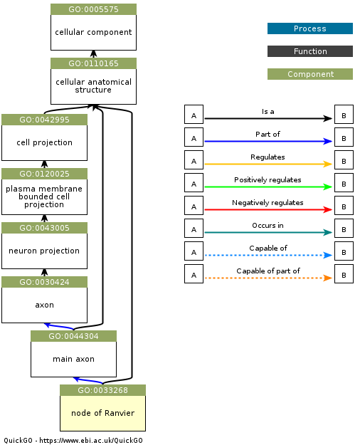

# Data Organization and Management

```{contents}
```

- talk about Potti case - https://www.nature.com/articles/nm0610-618a
- and/or Sudhof


## Principles of data management

Research data vary in their value, and in some cases can be highly valuable.  For example, the Large Hadron Collider at CERN, which was responsible for the data supporting the discovery of the Higgs Boson in 2012, has computing costs alone of [about $275 Million](https://en.as.com/latest_news/how-much-money-did-cerns-large-hadron-collider-cost-to-build-and-who-paid-for-it-n/), such that the loss of the resulting data from those computations would have enormous costs. Similarly, the data resulting from the LIGO gravitational wave detectors are enormously valuable, since those events by definition cannot be recreated.  For this reason, scientific agencies have long focused on developing frameworks for research data management. In the US, the National Institute of Standards and Technology (NIST) has developed a [Research Data Framework](https://www.nist.gov/programs-projects/research-data-framework-rdaf) that provides researchers with a detailed set of best practices for research data management.  

### The data management lifecycle

An important concept in research data management is the *data management lifecycle*, which refers to the different stages of a research project.  Figure {numref}`Figure {number} <NIST_RDA-fig>` shows an example of how the NIST Research Data Framework outlines the stages of the data management lifecycle:

:::{figure-md} NIST_RDA-fig


A depiction of the data management lifecycle, from the NIST Research Data Framework.  Republished courtesy of the National Institute of Standards and Technology.
:::

This figure highlights the fact that data management should be part of the discussion at each stage in a project.  Throughout this chapter we will discuss various aspects of data management that are relevant to these different stages of the lifecycle of a project.


### Data Management Plans

Research funding agencies are increasingly requiring data management plans (DMPs) for grant submissions.  In the US, both the National Science Foundation (NSF) and National Institutes of Health (NIH) require a DMP to accompany grant proposals, and the European Research Council (ERC) requires that funded projects submit a DMP within their first six months.  Creating a data management plan in advance of a project can be very helpful, as it helps encourage the early integration of methods that can help make data management and sharing easier as the project matures.  We will not go into detail regarding these plans, which will vary in their requirements depending on the funding agency. However, there are online tools available to assist with generation of a DMP:

- [DMPtool](https://dmptool.org/) - for US funding agencies
- [Data Stewardship Wizard](https://ds-wizard.org/) - for European funding agencies

I recommend always creating a data management plan at the start of a project, even if it's not required by your institution or funding agency.


## The FAIR Principles

The FAIR Principles {cite:p}`Wilkinson:2016aa` are a set of guiding principles for the effective sharing of research objects, including but not limited to research data.  The FAIR acronym refers to four features of research objects that are essential to effective sharing:

### Findable

Data are findable if they could be reasonably found by another researcher, usually via the Internet.  Making data findable involves:

- Associating them with a persistent identifier (such as a digital object identifier, or DOI)
- Placing them in a repository that is searchable
- Including sufficient machine-readable metadata to allow a successful search

### Accessible

Data are accessible if they can be accessed via clear procedures once they have been found. Making data accessible involves:

- Providing access by standard protocols (such as HTTP or Globus)
- Providing access to the metadata, even if the raw data are not available
- Providing clear information regarding any limits on access and requirements for data access, if the data are not openly available

Note that "accessible" doesn't necessarily imply "open"; in many cases, access to the data themselves may require additional data usage agreements between institutions.  Accessibility in the FAIR sense simply requires that there is a clear process by which the data can be accessed.

### Interoperable

Data are interoperable if they can be easily used by a researcher after they have been accessed.  Making data interoperable primarily involves:

- making the data accessible via standard file formats
- making the metadata available using standard vocabularies or ontologies

### Reusable

Data are reusable if the requirements for reuse are clearly specified.  Making data reusable involves:

- Providing a clear usage agreement (or "license"[^1]) for the data 
- Providing a clear and comprehensive description of the provenance of the data

The FAIR principles are relatively abstract, in the sense that they don't provide specific guidance about what FAIR means in any particular domain.  However, there are numerous resources that can help implement these principles, such as [RDMKit](https://rdmkit.elixir-europe.org/) and the [FAIR Cookbook](https://faircookbook.elixir-europe.org/content/home.html), both generated by the European ELIXIR organization.

## Data management best practices

We now turn to tools and best practices for data management in practice, starting with a "worst practice" that is unfortunately too common in science.

### Russ's First Law of Scientific Data Management

> "Don't use spreadsheets to manage scientific data."

In this chapter I will talk in detail about best practices for data management, but I start by discussing a data management "anti-pattern", which is the use of spreadsheets for data management.  Spreadsheet software such as Microsoft Excel is commonly used by researchers for all sorts of data management and processing operations.  Why are spreadsheets problematic?

- They encourage manual manipulation of the data, which makes the operations non-reproducible by definition.
- Spreadsheet tools will often automatically format data, sometimes changing things in important but unwanted ways.  For example, gene names such as "SEPT2" and "MARCH1" are converted to dates by Microsoft Excel, and some accession numbers (e.g. "2310009E13") are converted to floating point numbers.  An analysis of published genomics papers {cite:p}`Ziemann:2016aa` found that roughly twenty percent of supplementary gene lists created using Excel contained errors in gene names due to these conversions.
- It is very easy to make errors when performing operations on a spreadsheet, and these errors can often go unnoticed.  A well known example occurred in the paper  ["Growth in the time of debt"](https://www.nber.org/papers/w15639) by the prominent economists Carmen Reinhart and Kenneth Rogoff. This paper claimed to have found that high levels of national debt led to decreased economic growth, and was used as a basis for promoting austerity programs after the 2008 financial crisis.  However, [researchers subsequently discovered](https://academic.oup.com/cje/article/38/2/257/1714018) that the authors had made an error in their Excel spreadsheet, excluding data from several countries; when the full data were used, the relationship between growth and debt became much weaker. 
- Spreadsheet software can sometimes have limitations that can cause problems.  For example, the use of an outdated Microsoft Excel file format (.xls) [caused underreporting of COVID-19 cases](https://www.bbc.com/news/technology-54423988) due to limitations on the number of rows in that file format, and the lack of any warnings when additional rows in the imported data files were ignored.
- Spreadsheets do not easily lend themselves to version control and change tracking, although some spreadsheet tools (such as Google Sheets) do provide the ability to clearly label versions of the data.

I will occasionally use Microsoft Excel to examine a data file, but I think that spreadsheet tools should *never* be used as part of a scientific data workflow.

### Practical principles for scientific data management

This chapter will lay out a set of approaches for effective data management, which are built around a set of principles that I think are useful and practical for researchers:

- Original data should be immutable (read-only)
- Original data should be backed up on a separate system
- Data access should operate according to the principle of least privilege
- All data processing operations should be reproducible
    - Thus, manual operations should be minimized and extensively documented
- File/folder names should be machine-readable
- Open and non-proprietary file formats should be used whenever possible
- The provenance of any file should be findable
- All data should be documented so that the user can determine the identity of any variable in the dataset
- Changes to the data should be tracked
    - Either via VCS or some other strategy
- When working with secondary data, always know your rights and responsibilities
- Understand the data storage/retention/deletion requirements for your data


## Storing data: File system versus database?

- files vs database systems

One important factor in the choice of database versus flat file storage is what software tools will be used to analyze the data.  If the analyses are primarily being performed using custom code in Python or R, then it is relatively easy to either retrieve information from a database or load data from a flat file.  However, in some fields (including the field of neuroimaging where I work) it is common to use software packages that are built to process flat files, which strongly drives researchers in the field towards that approach.

Most of the discussion below will focus on file system data organization, primarily because that's where my expertise lies, but many of the principles also apply to the database case as well.

## Data access

Access to research data within a research group should operate by the *Principle of Least Privilege*, which is a general approach to computer security that states that any user should have only enough privileges to perform their intended actions, and no more. While this is most relevant to multi-user systems, it is often relevant even to systems with only a single user. With regard to data access, this principle has two important implications.  First, any particular dataset should be accessible only to users who have permission and need to use those data. Second, if data are meant to be accessed by a user but not modified by that user, then the user should have read-only access to the data.  

Even when a user may have a need to modify data, it often makes sense to set the data as read-only, so that any modifications require an explicit permissions change before the modifications can be made. This can help prevent accidental changes or data deletion, even on a single-user system.


## Managing original data

By *original* data I mean data that were obtained by the researcher from another source, such as from a recording device or by manual recording.  These are the data that, if lost, would constitute an irretrievable loss of the scientific record. As such, these data should be protected in a way that is different from *derivative* data that are obtained via processing of the original data.  

### Immutable storage

It is important to ensure that the original data are not modified, either accidentally or intentionally.  This can be achieved by setting the permissions on the files as read-only, though it is important to note that a user with superuser privileges could still make changes to the data.  For this reason, it is also important to store information that allows the validation of each file as matching its original.  This can be easily achieved by computing a *checksum* for each file and storing it separately. A checksum is a mathematical function of the file contents, which changes if any of the data in the file are changed and thus can serve as a "fingerprint" for the file contents:

```bash
➤  echo "file contents" > file1.txt
➤  echo "file content" > file2.txt
➤  diff file1.txt file2.txt
1c1
< file contents
---
> file content

➤  md5sum file1.txt
081404b3d2ae5bf599add15b7445ac07  file1.txt
➤  md5sum file2.txt                                                       1 ↵
186e4cee4e00635b35be4236193f33fb  file2.txt
```

There are various types of checksums, such as MD5 (used in the example above) or SHA-1, any of which should be suitable for validating file identity.  However, the different methods produce different checksums so it's important to document which method was used to create them.

### Backup

Disasters can occur that can render data irretrievable, from a major flood or earthquake to a cup of coffee spilled onto a laptop.  It is essential to maintain a backup of the original data for disaster recovery purposes.  This backup should be located on a system that is geographically separate from the main storage, such as a cloud server.

Many researchers store their data using RAID systems (which stands for "redundant array of independent disks"), which can provide some degree of resilience against disk failure.  Depending on the RAID configuration, these systems can survive the failure of one or more individual disks without data loss. However, storage on a RAID system is not a suitable replacement for backup, as these systems can still fail (e.g. due to a fire or flood that damages multiple disks).  


## Data formats and file types

There is a wide range of different data formats and file types used across science.  Here I will cover some of the most widely used formats and file types, realizing that there are many areas of science that use highly specialized formats/file types that I can't cover in depth here.

### Tabular data

Tabular data are loosely defined as data stored in rows and columns, as in a spreadsheet.   A *data frame* is a particular representation of tabular data, in which each column in the dataset has a label and each row has an *index* value that refers to that row.  The packages supporting data frames (such as `pandas` in Python) generally provide a set of operations that can be performed on the data frame, such as filtering, sorting, merging, or pivoting.

#### Long, wide, and tidy tabular data

There are multiple ways to organize data within a tabular dataset, reflecting what each column and row refer to.  This distinction is often referred to as *long* versus *wide* data, though in reality there is really a spectrum of organization between these extremes. *Wide data* generally refers to data where each row refers to a single observational unit (such as a one site, person, or planet), and each column refers to different variables measured for that unit. For example, let's say that we had measurements of height, weight, and blood pressure from three individuals.  A wide representation of these data would have one row per individual, with an identifier column identifying the individual and separate columns for each of the measurements:

|   id |   height |   weight |   blood_pressure |
|-----:|---------:|---------:|-----------------:|
|    1 |      170 |       70 |              120 |
|    2 |      180 |       80 |              130 |
|    3 |      175 |       75 |              125 |

*Long data* generally refers to data where different variables measured for a unit are spread across rows.  In this case, there are separate columns that specifies the variable being measured, the value of the variable for that unit, and the identity of the unit being measured.  

|   id | measurement    |   value |
|-----:|:---------------|--------:|
|    1 | height         |     170 |
|    2 | height         |     180 |
|    3 | height         |     175 |
|    1 | weight         |      70 |
|    2 | weight         |      80 |
|    3 | weight         |      75 |
|    1 | blood_pressure |     120 |
|    2 | blood_pressure |     130 |
|    3 | blood_pressure |     125 |


A related concept is the notion of *tidy data*, popularized by Hadley Wickham who is leader in the *R* language community.  While it is often associated with long data, the concept of tidy data actually refers to the meaning of the data rather than its shape.  Tidy data has three features, as specified by {cite:p}`Wickham:2014aa`:

- each variable is a column
- each observation is a row
- each type of observational unit is a table. 

It's easiest to understand these concepts by looking at some examples of datasets that *are not* tidy, following the examples laid out by {cite:p}`Wickham:2014aa`

##### Column headers are values, not variable names

Sometimes data are spread across columns where each column refers to a different value of the variable.  For example, the following table shows cancer pathology data from three hospitals, with different columns quantifying the number of samples falling into each of four different tumor stages:

| site   |   Stage1 |   Stage2 |   Stage3 |   Stage4 |
|:-------|---------:|---------:|---------:|---------:|
| H1     |       46 |       27 |       38 |       32 |
| H2     |       37 |       48 |       31 |       27 |
| H3     |       25 |       37 |       33 |       23 |


There are really three different variables represented in this table: Site, Stage, and frequency.  What we really want is to have three columns, representing those three variables.  We can achieve this using the `melt` function from `pandas`:

```python
df_tidy = pd.melt(df, id_vars=["site"], 
    var_name="Stage", value_name="Frequency")
# make stage an integer
df_tidy.Stage = df_tidy.Stage.str.replace("Stage", "").astype(int)
print(df_tidy.to_markdown(index=False))
```

| site   |   Stage |   Frequency |
|:-------|--------:|------------:|
| H1     |       1 |          46 |
| H2     |       1 |          37 |
| H3     |       1 |          25 |
| H1     |       2 |          27 |
| H2     |       2 |          48 |
| H3     |       2 |          37 |
| H1     |       3 |          38 |
| H2     |       3 |          31 |
| H3     |       3 |          33 |
| H1     |       4 |          32 |
| H2     |       4 |          27 |
| H3     |       4 |          23 |


##### Multiple variables are stored in one column

This pattern takes the previous one a step further, by defining columns based on the values of more than one variable.  For example, let's say that there data for both lung and prostate cancer:

| site   |   Stg1Lng |   Stg2Lng |   Stg3Lng |   Stg4Lng |   Stg1Prs |   Stg2Prs |   Stg3Prs |   Stg4Prs |
|:-------|----------:|----------:|----------:|----------:|----------:|----------:|----------:|----------:|
| H1     |        44 |        32 |        21 |        28 |        48 |        24 |        44 |        34 |
| H2     |        22 |        30 |        22 |        45 |        26 |        49 |        31 |        32 |
| H3     |        48 |        40 |        26 |        33 |        46 |        33 |        24 |        25 |

In this example, each value column represents a combination of stage and type of cancer.  We can tidy this by first melting the data frame, and then splitting the combined column names into separate variables for Stage and Cancer type:


```python
# tidy this, first by melting
df_tidy = pd.melt(df, id_vars=["site"], 
    var_name="Stage_Cancer", value_name="Freq")
# then split Stage_Cancer into two columns
df_tidy[["Stage", "Cancer"]] = df_tidy.Stage_Cancer.str.extract(r'Stg(\d)(\w{3})')
del df_tidy["Stage_Cancer"]
# make Stage an integer
df_tidy.Stage = df_tidy.Stage.astype(int)
# reorder columns
df_tidy = df_tidy[["site", "Stage", "Cancer", "Freq"]]
print(df_tidy.to_markdown(index=False))
```

| site   |   Stage | Cancer   |   Freq |
|:-------|--------:|:---------|-------:|
| H1     |       1 | Lng      |     44 |
| H2     |       1 | Lng      |     22 |
| H3     |       1 | Lng      |     48 |
| H1     |       2 | Lng      |     32 |
| H2     |       2 | Lng      |     30 |
| H3     |       2 | Lng      |     40 |
| H1     |       3 | Lng      |     21 |
| H2     |       3 | Lng      |     22 |
| H3     |       3 | Lng      |     26 |
| H1     |       4 | Lng      |     28 |
| H2     |       4 | Lng      |     45 |
| H3     |       4 | Lng      |     33 |
| H1     |       1 | Prs      |     48 |
| H2     |       1 | Prs      |     26 |
| H3     |       1 | Prs      |     46 |
| H1     |       2 | Prs      |     24 |
| H2     |       2 | Prs      |     49 |
| H3     |       2 | Prs      |     33 |
| H1     |       3 | Prs      |     44 |
| H2     |       3 | Prs      |     31 |
| H3     |       3 | Prs      |     24 |
| H1     |       4 | Prs      |     34 |
| H2     |       4 | Prs      |     32 |
| H3     |       4 | Prs      |     25 |


##### Variables are stored in both rows and columns

We could also some variables denoted by their own column with others split across columns:

| site   | Cancer   |   Stage1 |   Stage2 |   Stage3 |   Stage4 |
|:-------|:---------|---------:|---------:|---------:|---------:|
| H1     | Lng      |       44 |       32 |       21 |       28 |
| H1     | Prs      |       48 |       24 |       44 |       34 |
| H2     | Lng      |       22 |       30 |       22 |       45 |
| H2     | Prs      |       26 |       49 |       31 |       32 |
| H3     | Lng      |       48 |       40 |       26 |       33 |
| H3     | Prs      |       46 |       33 |       24 |       25 |

Here we can melt the data frame to collect the Stage columns:

```python
# gather to make it tidy
df_both_tidy = pd.melt(df_both, id_vars=["site", "Cancer"], 
    var_name="Stage", value_name="Frequency")
# make Stage an integer
df_both_tidy.Stage = df_both_tidy.Stage.str.replace("Stage", "").astype(int)
print(df_both_tidy.to_markdown(index=False))
```

| site   | Cancer   |   Stage |   Frequency |
|:-------|:---------|--------:|------------:|
| H1     | Lng      |       1 |          44 |
| H1     | Prs      |       1 |          48 |
| H2     | Lng      |       1 |          22 |
| H2     | Prs      |       1 |          26 |
| H3     | Lng      |       1 |          48 |
| H3     | Prs      |       1 |          46 |
| H1     | Lng      |       2 |          32 |
| H1     | Prs      |       2 |          24 |
| H2     | Lng      |       2 |          30 |
| H2     | Prs      |       2 |          49 |
| H3     | Lng      |       2 |          40 |
| H3     | Prs      |       2 |          33 |
| H1     | Lng      |       3 |          21 |
| H1     | Prs      |       3 |          44 |
| H2     | Lng      |       3 |          22 |
| H2     | Prs      |       3 |          31 |
| H3     | Lng      |       3 |          26 |
| H3     | Prs      |       3 |          24 |
| H1     | Lng      |       4 |          28 |
| H1     | Prs      |       4 |          34 |
| H2     | Lng      |       4 |          45 |
| H2     | Prs      |       4 |          32 |
| H3     | Lng      |       4 |          33 |
| H3     | Prs      |       4 |          25 |


##### Single type of observational unit spread across multiple tables

Sometimes we might have different data frames for each observation unit, such as a different data frame for each hospital in our example. To fix this we can simple merge the data frames by concatenating them:

```python
df_merged = pd.concat([df1, df2, df3], ignore_index=True)
```

#### Tabular file formats

The most common file formats are *comma-separated value* (CSV) or *tab-separated value* (TSV) files.  Both of these have the benefit of being represented in plain text, so their contents can be easily examined without any special software.  I generally prefer to use tabs rather than commas as the separator (or *delimiter*), primarily because they can more easily naturally represent longer pieces of text that may include commas. These can also be represented using CSV, but they require additional processing in order to *escape* the commas within the text so that they are not interpreted as delimiters.  

Text file formats like CSV and TSV are nice for their ease of interpretability, but they are highly inefficient for large data compared to optimized file formats, such as the *Parquet* format.  To see this in action, I loaded a brain image and saved all of the non-zero data points (857,785 to be exact) to a data frame, which I then saved to CSV and Parquet formats; see [the management notebook](src/BetterCodeBetterScience/data_management.ipynb) for details.  Looking at the resulting files, we can see that the Parquet file is only about 20% the size of the CSV file:

```bash
➤  du -sk /tmp/brain_tabular.*
19464	/tmp/brain_tabular.csv
3804	/tmp/brain_tabular.parquet
```

When we look at the amount of time needed to load these files, we see an even stronger edge for the Parquet format. Because the loading times can vary due to other activity on the system, we load each 100 times to get an average load time:

```python
iimport time
# time loading of each format
# load 100 times to get average loading time of each format

nreps = 100
start = time.time()
for _ in range(nreps):
    df_csv = pd.read_csv('/tmp/brain_tabular.csv')
end = time.time()
csv_time = (end - start)/nreps
print(f"CSV load time: {csv_time:.4f} seconds")

start = time.time()
for _ in range(nreps):
    df_parquet = pd.read_parquet('/tmp/brain_tabular.parquet')
end = time.time()
parquet_time = (end - start)/nreps
print(f"Parquet load time: {parquet_time:.4f} seconds")
print(f'ratio {csv_time/parquet_time:.2f}')```

```
CSV load time: 0.0719 seconds
Parquet load time: 0.0082 seconds
ratio 8.77
```

Here we see that loading the CSV file takes almost 9 times as long as the Parquet file.  For a single file of this size this is not a meaningful difference in times, but for projects involving many files or much larger files the difference in loading times could become a real game-changer.


### Multidimensional array data

Many forms of data are represented as multidimensional arrays.  For example, many forms of microscopy data are represented as either two-dimensional (slice) or three-dimensional (volume) arrays, while dynamic imaging modalities are often represented as three- or four-dimensional data, with the first two or three dimensions representing space and the final dimension reflecting time.  Within Python these are generally processed using `numpy`, which efficiently processes large multidimensional arrays.  As an example, I loaded a four-dimensional brain template, where the first three dimensions are spatial and the final dimension reflects 512 different components that define a probabilistic atlas of the brain.  After loading the data into a `numpy` array, we can see its shape:

```python
data.shape
```
```bash
(91, 109, 91, 512)
```

In this case, the first three dimensions are spatial (representing the left/right, front/back, and up/down axes of the brain) and the final dimension represents timepoints.  We can also use the `imshow` function from `matplotlib.pyplot` to view a two-dimensional slice of the image at a particular timepoint:

```python
import matplotlib.pyplot as plt
# view z==50 at timepoint 5
plt.imshow(data[:, :, 50, 5], cmap='gray')
```


#### Multidimensional array file formats

A common file format for array data in Python is the native Numpy format, which is known by its extension, `.npy`.  This file format has a number of benefits for Python users:

- It is very fast to both read and write files
- It supports *memory mapping*, which allows portions of the file to be read without loading the entire file
- It has perfect fidelity and maintains exact data types
- It is very easy to use (`np.load()` to load and `np.save()` to save).

However, the `.npy` format also has a number of drawbacks for scientific data:

- It is harder for non-Numpy users to work with, requiring specialized libraries to read in languages other than Python.
- It does not compress the data, so files can be much larger than a compressed file format. This can become very important when working with large sparse datasets.
- It doesn't support storage of metadata alongside the data

There are several other commonly used standard file formats for array data; we will focus on *HDF5* and *Zarr*.  HDF5 is a longstanding format for storage of large datasets, which is supported by nearly all programming languages. It has built-in support for compression, and allows access to specific chunks without loading the entire dataset.  However, may researchers (at least within the Python ecosystem) are moving towards the Zarr format, which stores data in a set of smaller chunk files rather than a single large file as in HDF5.  Zarr has several advantages over HDF5:

- Zarr is much more efficient for cloud storage, since only the specific chunk file needs to be accessed
- Zarr is simpler than HDF5, and has a more Pythonic interface
- Zarr makes it very easy to add new data to a file, which can be more difficult in HDF5

Let's use the data from above as an example. This is a dataset that is highly sparse; after thresholding to remove very small values, only about 0.1% of the values are nonzero.  This means that we should be able to get a high degree of compression for this dataset, given the redundancy of the data.  Let's first save the data to a .npy file and look at its (uncompressed) size:

```python
np.save('/tmp/difumo.npy', data)
!du -sm /tmp/difumo.npy
```
```bash
3526	/tmp/difumo.npy
```

That's about 3.5 gigabytes.  Now let's save it to HDF5:

```python
import h5py
with h5py.File('/tmp/difumo.h5', 'w') as f:
    f.create_dataset('difumo', data=data, compression='gzip')
!du -sm /tmp/difumo.h5
```
```bash
10	/tmp/difumo.h5
```

Due to the compression by HDF5, the data file is about 350 times smaller with HDF5! We can also look at the same with Zarr:

```python
import zarr
zarr_data = zarr.open('/tmp/difumo.zarr', mode='w', shape=data.shape, dtype=data.dtype)
zarr_data[:] = data
!du -sm /tmp/difumo.zarr
```
```bash
5	/tmp/difumo.zarr
```

This shows that Zarr obtains double the compression of HDF5, each using its default compression method; note that it might be possible to get better compression using custom compression methods for each.  We can also compare the time needed to load each of the files; because of the relatively longer loading time for these files, we only perform 10 repetitions in this example:

```python
nreps = 10

for ext in ['npy', 'h5', 'zarr']:
    start_time = time.time()
    filename = f'/tmp/difumo.{ext}'
    if ext == 'npy':
        for _ in range(nreps):
            data_loaded = np.load(filename)
    elif ext == 'h5':
        for _ in range(nreps):
            with h5py.File(filename, 'r') as f:
                data_loaded = f['difumo'][:]
    elif ext == 'zarr':
        for _ in range(nreps):
            zarr_data = zarr.open(filename, mode='r')
            data_loaded = zarr_data[:]
    end_time = time.time()
    avg_load_time = (end_time - start_time) / nreps
    print(f"Average loading time for {ext}: {avg_load_time:.6f} seconds")
```
```bash
Average loading time for npy: 0.451627 seconds
Average loading time for h5: 3.138907 seconds
Average loading time for zarr: 0.745648 seconds
```

This shows that Zarr is slightly slower than the native `numpy` file load, but much faster than HDF5.  

I would suggest that unless you have a strong need for HDF5 compatibility, that you use Zarr files to store large binary data files such as matrices.  


#### Symmetrical matrices

It's not uncommon to work with symmetrical matrices, such as correlation matrices.  Since the upper triangle and lower triangle of a symmetric matrix are simply transposed versions of one another, there is no need to save both - we can simply save either the upper or lower triangle.  Depending on the application, this may be a useful way to save space and loading time. 

### Network/graph data

A graph is a representation that includes a set of nodes along with a set of edges that represent connections between those nodes. In some cases these are unweighted (binary), such as whether two individuals are friends on a social network.  In other cases they are weighted, such as number of common friends that two people have on a social network.  Graphs also vary in being either undirected, such that the relationship is bidirectional between the two nodes, or directional, such as the relationship has a direction.  For example, friendship on a social network is an undirected relationship, whereas following on a social network is a directed relationship, since one person can follow the other, vice versa, or both.  

One way to represent a graph is through a set of *adjacencies*, or connections.  Here is an example of a small social network, in which we generate a graph within the `networkx` package using a set of adjacencies:

```python
import networkx as nx

friends = [
    ('Bill', 'Sally'),
    ('Bill', 'Mark'),
    ('Bill', 'Elise'),
    ('Mark', 'Elise'),
    ('Mark', 'Lisa')
]
G = nx.Graph()
G.add_edges_from(friends)
G.edges
```
```bash
EdgeView([('Bill', 'Sally'), ('Bill', 'Mark'), ('Bill', 'Elise'), ('Mark', 'Elise'), ('Mark', 'Lisa')])
```

We can view this as a graph using the plotting functions in `networkx`:


Another way to represent a graph is via an *adjacency matrix*, which numerically represents the relations between nodes in the graph.  We can generate this from the `networkx` graph:

```python
adj_matrix = nx.adjacency_matrix(G).todense()
labels = list(G.nodes)
adj_df = pd.DataFrame(adj_matrix, index=labels, columns=labels)
print(adj_df.to_markdown())
```

|       |   Bill |   Sally |   Mark |   Elise |   Lisa |
|:------|-------:|--------:|-------:|--------:|-------:|
| Bill  |      0 |       1 |      1 |       1 |      0 |
| Sally |      1 |       0 |      0 |       0 |      0 |
| Mark  |      1 |       0 |      0 |       1 |      1 |
| Elise |      1 |       0 |      1 |       0 |      0 |
| Lisa  |      0 |       0 |      1 |       0 |      0 |

#### Graph data file formats

There are a number of different file formats for graph data, used variously across different software packages.  For example, the `networkx` package supports 13 different graph formats!  The decision about which format to use will likely depend on the specific software packages that you plan to use. I have had good luck with both *GraphML* and *Pajek* formats. 

For large networks that are dense (i.e. networks where most connections are nonzero) or weighted (i.e. the edges have continuous weights) it might make more sense to save the network as an adjacency matrix, making sure to also save the associated node labels.  This allows taking advantage of the efficiency of formats like Zarr, though it will incur the overhead of having to load the adjacency matrix into the graph engine.

### Specialized data formats

Many subfields of science have developed specific file formats for the data in their domain, such as:

- In genomics, there are multiple formats include *FASTQ* for raw sequencing reads, *BAM*/*SAM* for aligned sequence reads, *VCF* for variant calls, and *BED* for genomic coordinates
- In structural biology, *PDB*/*mmCIF* for protein structures, and *MTZ* for X-ray diffraction data
- In chemistry, *MOL*/*SDF* for molecular structures
- In astronomy, *FITS* and *ASDF* for telescope data
- In neuroscience, *NWB* and *NIfTI*
- In the earth sciences, there are numerous formats for various types of spatial data

There is always a tension between using a domain-specific standard versus a general standard; the choice for any particular project will depend heavily on which software packages are being used for data analysis and what data formats they support, as well as the efficiency of the file formats. 


## Data organization schemes

- use a standard scheme if it exists
    - preferably one with an automated validator
- everything should be machine readable

### File granularity

One common decision that we need to make when managing data is to save data in more smaller files versus fewer larger files.  The right answer to this question depends in part on how we will have to access the data.  If we only need to access a small portion of the data and we can easily determine which file to open to obtain those data, then it probably makes sense to save many small files.  However, if we need to combine data across many small files, then it likely makes sense to save the data as one large file.  For example, in the [data management notebook](src/BetterCodeBetterScience/data_management.ipynb) there is an example where we create a large (10000 x 100000) matrix of random numbers, and save them either to a single file or to a separate file for each row.  When loading these data, the loading of the single file is about 5 times faster than loading the individual files.

Another consideration about the number of files has to do with storage systems that are commonly used on high-performance computing systems.  On these systems, it is common to have separate quotas for total space used (e.g. in terabytes) as well as for the number of *inodes*, which are structures that store information about files and folders on a UNIX filesystem. Thus, generating many small files (e.g. millions) can sometimes cause problems on these systems. For this reason, we generally err on the side of generating fewer larger files versus more smaller files when working on high-performance computing systems.

### Data file/folder naming conventions

From my standpoint, the most important consideration for naming of files and folders is the ability to automatically parse the file/folder names.  While there are may possible ways to do this, I prefer the approach used in the Brain Imaging Data Structure (BIDS), which our group was involved in developing {cite:p}`Gorgolewski:2016aa`.  This is a standard for organizing a wide range of brain imaging data types, but the strategy behind the standard is applicable to almost any scientific data types.  The basic idea is to embed a set of key-value pairs in the name, along with a suffix that defines the data type along with a file type extension for files.  The schema looks like this:

`<key>-<value>_<key>-<value>_suffix.extension`

This is useful because it is very easy to automatically parse such a file name.  For example, let's say we have a file called 'sub-001_sess-1A_desc-Diffusion_fa.nii.gz'.  We can easily parse file names like this as follows:

```python
filename = 'sub-001_sess-1A_desc-Diffusion_fa.nii.gz'

def split_filename(filename):
    extension = '.'.join(filename.split('.')[1:])
    name = filename.split('.')[0]
    key_values = {k:v for k,v in (item.split('-') for item in name.split('_')[:-1])}
    key_values['suffix'] = name.split('_')[-1]
    return extension, key_values

extension, key_values = split_filename(filename)
print(key_values)
```
```python
{'desc': 'Diffusion', 'sess': '1A', 'sub': '001', 'suffix': 'fa'}
```

This is very useful because it allows one to easily query a large set of files for particular key-value pairs, and also allows one to easily parse the key-value pairs for a particular file.  

It's worth nothing that using a naming scheme like this requires strict attention to naming hygiene.  In particular, it's essential to ensure that the delimiter characters ("-" and "_") don't accidentally get used within the values.  For example, if one were using an analysis called "IS-RSA", using this for the description (e.g. "'sub-001_sess-1A_desc-IS-RSA_corr.zarr") would cause file parsing to fail.  

## Metadata

*Metadata* refers to "data about data", and generally is meant to contain the information that is needed to interpret a dataset.  In principle, someone who obtains a dataset should be able to understand and reuse the data using only the metadata provided alongside the dataset. There are many different types of metadata that might be associated with a study, and it is usually necessary to decide how comprehensive to be in providing detailed metadata.  This will often rely upon the scientific expertise and judgment of the researcher, to determine which particular metadata would be essential for others to usefully interpret and reuse the data.

An important concept in metadata is the *ontology*. In the context of bioinformatics, an ontology is a structured representation of the entities that exist in a domain (defined by a *controlled vocabulary*) and the relationships between these entities. One of the best known examples in the Gene Ontology, which represents classes of biological entities including Molecular Functions, Cellular Components, and Biological Processes.  As an example, Figure {numref}`Figure {number} <GO-fig>`

:::{figure-md} GO-fig


An example of a Gene Ontology graph for the entity "node of Ranvier", which is a component of a neuron.  Obtained from https://www.ebi.ac.uk/QuickGO/GTerm?id=GO:0033268.
:::

Ontologies are very useful for specifying metadata, because they allow us to know exactly what a particular entry in the metadata means, and thus allow us to establish link between equivalent entities across datasets.  For example, let's say that a researcher wants to query a database for datasets related to insulin signaling in pancreatic beta cells in Type II diabetes, and that there are three relevant datasets in the database.  Without an ontology, each of the teams might use different terms to refer to these cells (such as "pancreatic beta cells", "insulin-producing cells", and "islet beta cells"), making it difficult to link the datasets. However, if each of the datasets were to include metadata linked to a specific ontology (in this case, the identifier `CL:0000169` from the Cell Ontolog, which refers to "type B pancreatic cell"), then it becomes much easier to find and link these datasets.  There are at present a broad range of ontologies available for nearly every scientific domain; the [BioPortal](https://bioportal.bioontology.org/) project provides a tool to search across a wide range of existing ontologies.

### Metadata file formats

An important feature of metadata is that it needs to be *machine-readable*, meaning that it is provided in a structured format that be automatically parsed by a computer.  Common formats are Extensible Markup Language (XML) and JavaScript Object Notation (JSON).  JSON is generally simpler and more human-readable, but it doesn't natively provide the ability to define attributes for particular entries (such as the units of measurement) or link to ontologies.  An extension of JSON known as *JSON-LD* (JSON for Linked Data) provides support for the latter, by allowing links to controlled vocabularies.

For example, let's say that I wanted to represent information about an author (myself) in JSON, which I might do like this:

```json
{
  "name": "Russell Poldrack",
  "affiliation": "Stanford University",
  "email": "russpold@stanford.edu"
}
```

Now let's say that someone else wanted to search across datasets to find researchers from Stanford University. They would have no way of knowing that I used the term "affiliation" as opposed to "organization", "institiution", or other terms.  We could instead represent this using JSON-LD, which is more verbose but allows us to link to a vocabulary (in this case schema.org) that defines these entities by providing a `@context` tag:

```json
{
  "@context": "https://schema.org",
  "@type": "Person",
  "name": "Russell Poldrack",
  "affiliation": {
    "@type": "Organization",
    "name": "Stanford University"
  },
  "email": "russpold@stanford.edu"
}
```


## Data documentation

While metadata is generally meant to be used by computers, it is also important to provide human-readable documentation for a dataset, so that other researchers (or one's own self in the future) can understand and reuse the data successfully.  There are two forms of documentation that can be important to provide.

### Data dictionaries

A *data dictionary* provides information about each of the variables in a dataset. These are meant to be human readable, though it can often be useful to share them in a machine-readable format (such as JSON) so that they can also be used in programmatic ways.  A data dictionary includes information such as:

- an understandable description of the variable 
- the data type (e.g. string, integer, Boolean)
- the allowable range of values

For example, a study of immune system function in human participants might include the following in its data dictionary:

| Variable Name | Data Type | Allowable Values | Description |
|---------------|-----------|------------------|-------------|
| age           | Integer   | 0-120            | Age of the participant in years |
| gender        | String    | M, W, O          | Participant's self-identified gender |
| crp           | Numeric   | 0.1-50.0, -90, -98, -99| C-reactive protein level (mg/L) |


### Codebooks

A codebook is meant to be a more human-friendly description of the content of the dataset, focusing on how the data were collected and coded. It often includes a detailed description of each variable that is meant to help understand and interpret the data.  For the example above, the codebook might include the following:

*Variable Information*

- Variable name: crp

- Variable label: High-sensitivity C-reactive protein

- Variable definition: A quantitative measure of C-reactive protein in blood serum.

*Measurement and Coding*
- Data Type: Numeric (Floating Point, 2 decimal places)
- Units of Measurement: mg/L (milligrams per Liter)
- Measurement Method: Immunoturbidimetric assay.
- Instrument: Roche Cobas c702 clinical chemistry analyzer.
- Allowable Range: 0.10 - 50.00
    - Note: The lower limit of detection for this assay is 0.10 mg/L.
- Values and Codes:
    - [Numerical Value]: A continuous value from 0.10 to 50.00 represents the measured concentration in mg/L.
    - -90: Value below the lower limit of detection (< 0.10 mg/L).
    - -98: Unusable sample (e.g., sample was hemolyzed, insufficient quantity).
    - -99: Missing (e.g., sample not collected, participant refused blood draw).

*Collection Protocol and Provenance*
- Specimen Type: Serum from a venous blood sample.
- Collection Procedure: Blood was drawn from the antecubital vein into a serum separator tube (SST) after an 8-hour overnight fast. The sample was allowed to clot for 30 minutes, then centrifuged at 1,500 x g for 15 minutes. Serum was aliquoted and stored at -80°C until analysis.
- Date of Creation: 2025-11-15
- Version: 1.0

It is essential to generate data dictionaries and codebooks upon the generation of the dataset; otherwise important details may be lost.

## Provenance

*Provenance* refers to particular metadata regarding the history of processes and inputs that give rise to a particular file.  Tracking of provenance is essential to ensure that one knows exactly how a particular file was created.  This includes:

- the origin of original data (such as the instrument used to collect it, or date of collection)
- the specific input files that went into creation of the file, for files that are derived data
- the specific versions of any software tools that were used to create the file
- the specific settings used for the software tools

Tracking of provenance is non-trivial.  The World Wide Web Consortium (W3C) has developed a framework called [PROV](https://www.w3.org/TR/2013/NOTE-prov-primer-20130430/) which defines a model for the representation of provenance information.  This framework provides an overview of the many features of provenance that one might want to record for an information that is shared online.  The PROV data models defines three main concepts:

- Entities - things that are produced, such as datasets and publications
- Activities - processes that involve using, generating, or modifying entities
- Agents - People, organizations, or artifacts (such as computers) that are responsible for activities

In addition, the model defines a set of relationships between these concepts, as seen in Figure {numref}`Figure {number} <PROV-fig>`:

:::{figure-md} PROV-fig


A depiction of the PROV data model entities and relations.  Copyright © [2013] [World Wide Web Consortium](https://www.w3.org/copyright/document-license-2023/).
:::

This data model highlights the breadth of information that needs to be represented in order to accurately record provenance.

There are several different ways to track provnenance in practice, which vary in their complexity, comprehensiveness, and ease of use.  We will discuss this in much more detail in a later chapter on workflows.


## Version control for data

In the case of original data we never want to allow any changes, but for derived data we will often end up making changes to our workflows that result in changes in the data.  As an example, let's say that we are analyzing RNA-sequencing data, and we receive a notice that a bug was found in the specific version of STAR that we had used for sequence alignment.  We would like to be able to track these changes, so that we know which data we are working with at any point in time. In many laboratories, this achieved through file naming, resulting in a menagerie of files with names like "dataset_new_fixed_v2.tsv".  This can make it difficult to determine exactly which data were used in any analysis. In Chapter 2 we discussed the many reasons why we use version control for code, and many of those also apply to data as well. In the case of data, it is particularly important to be able to track the what, when, and why of any changes to the data, which is exactly the purpose of version control systems.

### Using git for data version control

When the relevant data are small (e.g. smaller than a few megabytes) and stored in a text format (such as CSV/TSV), one can simply use git to track changes in the data.  (We will discuss in a later chapter why Github is not an optimal platform for sharing data, at least not on its own.). 

However, git does not work well for version control on larger datasets using binary data files.  Git is able to efficiently store version information about code because it tracks the specific differences in the code between versions (known as a *diff*), and only stores the differences.  Thus, if one has a very large code file and changes one line, only that one line difference is stored in the git database.  However, with binary data this strategy is not effective, and git has to store the entire new dataset each time, leading to bloated respostories and very slow performance. 

### Using Datalad for version control on larger datasets

A solution to this problem is to use a version control tool that is specifically designed for large data.  There are several tools that address this problem; we will focus on [Datalad](https://www.datalad.org/), which is a data management system that functions very similarly to git.  It is based on a tool called [git-annex](https://git-annex.branchable.com/), but provides much greater ease of use for researchers.  (Full disclosure: Our group collaborates with the Datalad group and our grants have supported some of their development work.)

An important note:  Datalad is quite powerful but has a significant learning curve, and takes a bit of time to get accustomed to.  In particular, its use of symbolic links can sometimes confuse new users. Having said that, let's look at some simple examples.

#### Creating a local Datalad dataset

Let's say that we want to create a new dataset on our local computer that will be tracked by Datalad.  We first create a new repository:

```bash
➤  datalad create my_datalad_repo

create(ok): /Users/poldrack/Dropbox/code/BetterCodeBetterScience/my_datalad_repo (dataset)
```

This creates a new directory, called `my_datalad_repo` and sets it up as a Datalad dataset.  We then go into the directory and create a subdirectory called `data`, and then download some data files from another project.  We do this using the `datalad download-url` function, which will both download the data and save them to the datalad dataset:

```bash
➤  cd my_datalad_repo
➤  mkdir data
➤  datalad download-url --dataset . -O data/ \
  https://raw.githubusercontent.com/IanEisenberg/Self_Regulation_Ontology/refs/heads/master/Data/Complete_02-16-2019/meaningful_variables_clean.csv

[INFO   ] Downloading 'https://raw.githubusercontent.com/IanEisenberg/Self_Regulation_Ontology/refs/heads/master/Data/Complete_02-16-2019/meaningful_variables_clean.csv' into '/Users/poldrack/Dropbox/code/BetterCodeBetterScience/my_datalad_repo/data/'
download_url(ok): /Users/poldrack/Dropbox/code/BetterCodeBetterScience/my_datalad_repo/data/meaningful_variables_clean.csv (file)
add(ok): data/meaningful_variables_clean.csv (file)
save(ok): . (dataset)
action summary:
  add (ok: 1)
  download_url (ok: 1)
  save (ok: 1)

➤  datalad download-url --dataset . -O data/ \
  https://raw.githubusercontent.com/IanEisenberg/Self_Regulation_Ontology/refs/heads/master/Data/Complete_02-16-2019/demographics.csv

[INFO   ] Downloading 'https://raw.githubusercontent.com/IanEisenberg/Self_Regulation_Ontology/refs/heads/master/Data/Complete_02-16-2019/demographics.csv' into '/Users/poldrack/Dropbox/code/BetterCodeBetterScience/my_datalad_repo/data/'
download_url(ok): /Users/poldrack/Dropbox/code/BetterCodeBetterScience/my_datalad_repo/data/demographics.csv (file)
add(ok): data/demographics.csv (file)
save(ok): . (dataset)
action summary:
  add (ok: 1)
  download_url (ok: 1)
  save (ok: 1)
```

A Datalad dataset is also a `git` repository, which we can see if we use the `git log` command:

```bash
➤  git log

commit a5696c1a32d69dd24781652d04902047c5d3df50 (HEAD -> main)
Author: Russell Poldrack <poldrack@gmail.com>
Date:   Sun Nov 16 12:13:22 2025 -0800

    [DATALAD] Download URLs

    URLs:
      https://raw.githubusercontent.com/IanEisenberg/Self_Regulation_Ontology/refs/heads/master/Data/Complete_02-16-2019/demographics.csv

commit 2603a1fb98f00d6cdd029194f010a845d73cdc7c
Author: Russell Poldrack <poldrack@gmail.com>
Date:   Sun Nov 16 12:13:20 2025 -0800

    [DATALAD] Download URLs

    URLs:
      https://raw.githubusercontent.com/IanEisenberg/Self_Regulation_Ontology/refs/heads/master/Data/Complete_02-16-2019/meaningful_variables_clean.csv

commit 95b9016840e1d35bef0edf3afa06e41fdaaefce4
Author: Russell Poldrack <poldrack@gmail.com>
Date:   Sun Nov 16 12:12:08 2025 -0800

    [DATALAD] new dataset
```

Here we see the commit messages that were automatically created by Datalad, first for creating the new dataset and then for downloading the URLS.  The `datalad download-url` function adds the URL to the log, which is useful for provenance tracking.

#### Modifying files

Now let's say that we want to make a change to one of the files and save the changes to the dataset.  Files tracked by Datalad are read-only ("locked") by default.  If we want to edit them, then we need to use `datalad unlock` to unlock the file:

```bash
➤  datalad unlock data/demographics.csv

unlock(ok): data/demographics.csv (file)
```

We then use a Python script to make the change, which in this case is removing some columns from the dataset:

```bash
➤  python ../src/BetterCodeBetterScience/modify_data.py data/demographics.csv

```

We can now use `datalad status` to see that the file has been modified:

```bash
➤  datalad status
 modified: data/demographics.csv (file)
```

And we can then save it using `datalad save`:
```bash
➤  datalad save -m "removed Motivation variables from demographics.csv"

add(ok): data/demographics.csv (file)
save(ok): . (dataset)
action summary:
  add (ok: 1)
  save (ok: 1)
```

Datalad doesn't have a staging area like `git` does, so there is no need to first add and then commit the file; `datalad save` is equivalent to adding and then committing the changes. If we then check the status we see that there are no changes waiting to be saved:

```bash
➤  datalad status

nothing to save, working tree clean
```

#### Pushing data to a remote repository

Datalad is a particularly powerful tool for sharing data across systems.  It allows one to push or pull data from a number of different remote storage systems; in this example we will use the [Open Science Framework (OSF)](https://osf.io/) as our storage location, because it is particularly easy to use with Datalad.

We first need to install and set up the `datalad-osf` Python pagkage, per [the Datalad documentation](https://docs.datalad.org/projects/osf/en/latest/settingup.html).  We also need to create an account on the OSF site, and obtain a Personal Access Token for login.  We can then use Datalad to authenticate with OSF:

```bash
➤  datalad osf-credentials                                                1 ↵
You need to authenticate with 'https://osf.io' credentials. https://osf.io/settings/tokens provides information on how to gain access
token:
osf_credentials(ok): [authenticated as Russell Poldrack <poldrack@stanford.edu>]
```

Having authenticated with OSF, we can now create a new OSF project using Datalad:

```bash
➤  datalad create-sibling-osf --title datalad-test-project -s osf
create-sibling-osf(ok): https://osf.io/htprk/
[INFO   ] Configure additional publication dependency on "osf-storage"
configure-sibling(ok): . (sibling)
```

Once the project is created, we can push the contents of our dataset to our OSF project:

```bash
➤  datalad push --to osf
copy(ok): data/demographics.csv (file) [to osf-storage...]
copy(ok): data/meaningful_variables_clean.csv (file) [to osf-storage...]
publish(ok): . (dataset) [refs/heads/main->osf:refs/heads/main [new branch]]
publish(ok): . (dataset) [refs/heads/git-annex->osf:refs/heads/git-annex [new branch]]
action summary:
  copy (ok: 2)
  publish (ok: 2)
```

These data now exist on OSF, and can be cloned to our local machine using `datalad clone`:

```bash
➤  datalad clone osf://htprk/
[INFO   ] Remote origin uses a protocol not supported by git-annex; setting annex-ignore
install(ok): /Users/poldrack/Downloads/htprk (dataset)

➤  tree htprk
htprk
└── data
    ├── demographics.csv -> ../.git/annex/objects/f7/Mm/MD5E-s58237--dc5b157fb9937eae2166d73ee943c766.csv/MD5E-s58237--dc5b157fb9937eae2166d73ee943c766.csv
    └── meaningful_variables_clean.csv -> ../.git/annex/objects/J5/X6/MD5E-s1248729--e4fbac610f1f5e25e04474e55209ef56.csv/MD5E-s1248729--e4fbac610f1f5e25e04474e55209ef56.csv

```

Notice that the files in the cloned dataset directory are actually symbolic links; the actual file contents are not downloaded when the dataset is cloned. We can see this if we try to look at the size of the datafile:

```bash
➤  wc data/demographics.csv
wc: data/demographics.csv: open: No such file or directory
```

To actually download the file contents, we can use `datalad get`, after which we will see that the file contents are available:

```bash
➤  datalad get .                                                          1 ↵
get(ok): data/demographics.csv (file) [from web...]
get(ok): data/meaningful_variables_clean.csv (file) [from web...]
action summary:
  get (ok: 2)

➤  wc data/demographics.csv
     523    1276   58237 data/demographics.csv
```

One can also push data using Datalad to a range of other remote hosts; see the [Datalad documentation](https://handbook.datalad.org/en/latest/basics/101-138-sharethirdparty.html) for more on this.


## Working with secondary data


## Working with protected/private data


## Archiving data

- data retention/deletion policies


[^1]: Note that the term "license" is often used to describe these data usage agreements, but this terminology is technically inappropriate in jurisdictions such as the U.S. where data are treated as "facts" and thus are not subject to intellectual property laws (such as copyright laws). 